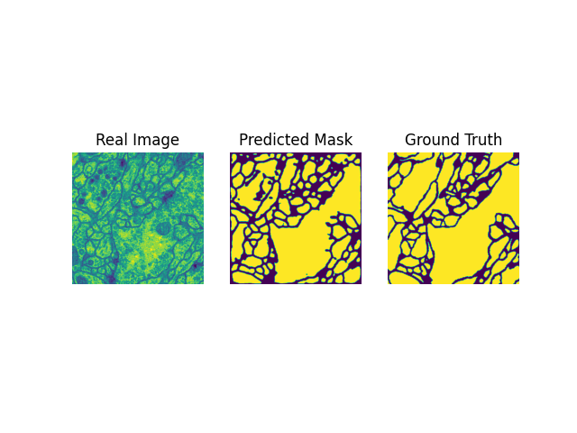
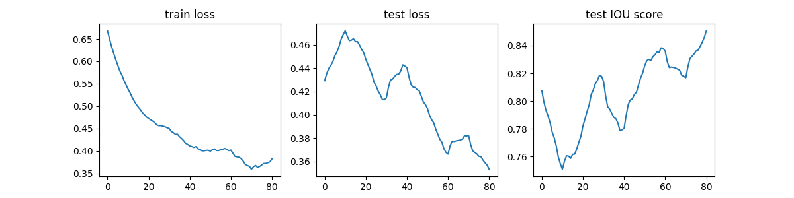

# Unet-Pytorch



This is a Pytorch implementation of U-Net architecture following the paper:

 "U-Net: Convolutional Networks for Biomedical Image Segmentation"

 https://arxiv.org/pdf/1505.04597.pdf


# Data
The data is from 2012 ISBI Biomedical segmentaion challenge

# Architecture
The model architecture is as follows:


Implementaion of this model is in `model.py`

# Data Augmentation
high quality dataset is pretty rare in the case of biomedical segmented data.
there is only 30 images in the training set.
since neural networks work better when trained on large enough data, I use various image augmentation methods suggested by the author of the paper e.g `HorizontalFlip`, `VerticalFlip`, `ElasticTransform`, `RandomRotation`, `RandomResizedCrop` etc.

All of this augmentation methods are in `augmentation.py`

# Loss Function

I used `BCEWithLogitsLoss` from `torch.nn` as my loss function

# Training
I used Adam optimizer with a constant learing rate of 2e-4.

training code is in `train.py`

to train the model, you just need to run:
```
python train.py
```

# Results
Intersection Over Union (IoU): 0.8345

